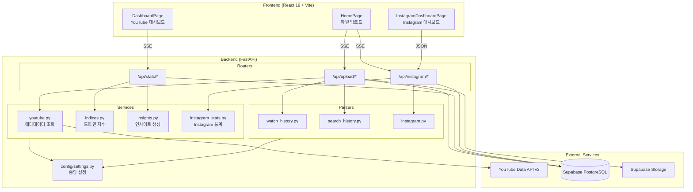
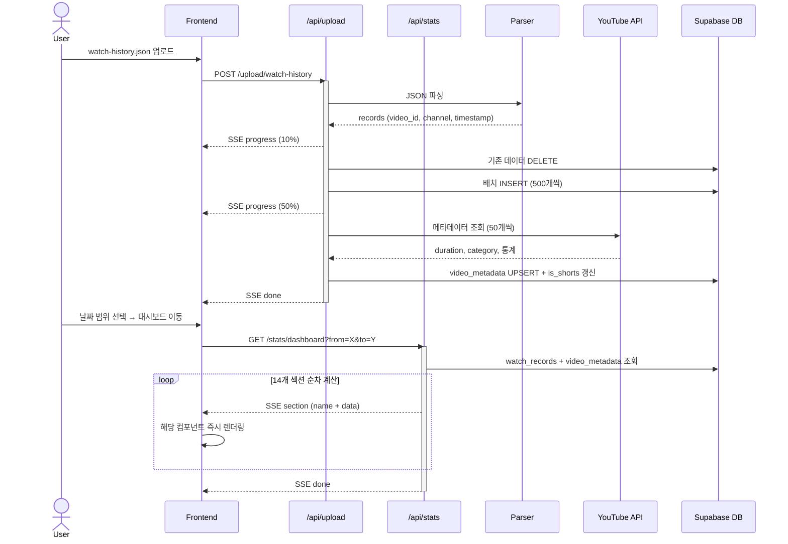
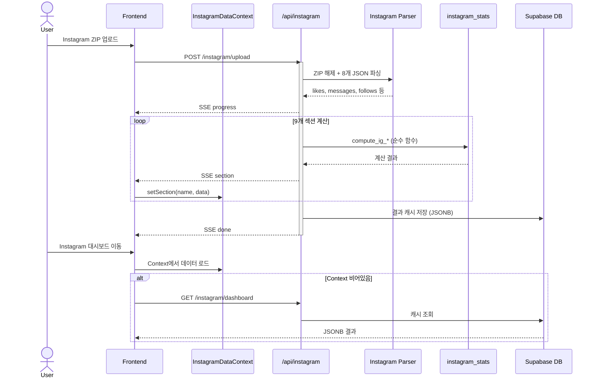
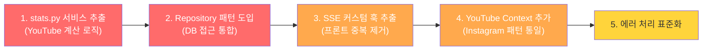

# WatchLens - Software Architecture

## Overview

WatchLens는 YouTube 시청 기록과 Instagram 데이터를 분석하여 사용자의 미디어 소비 패턴을 시각화하는 풀스택 웹 애플리케이션이다.

**핵심 기술 스택**: FastAPI + Supabase (Backend) / React 19 + TypeScript + Vite (Frontend)

---

## 시스템 구성도



---

## Backend 구조

### 디렉토리 레이아웃

```
backend/
├── app/
│   ├── main.py              # FastAPI 앱 초기화, CORS, 라우터 등록
│   ├── db/
│   │   └── supabase.py      # Supabase 클라이언트 (싱글턴)
│   ├── models/
│   │   └── schemas.py       # Pydantic 모델 (UploadResponse, ParseResult 등)
│   ├── parsers/
│   │   ├── watch_history.py # YouTube 시청 기록 JSON 파싱
│   │   ├── search_history.py# YouTube 검색 기록 JSON 파싱
│   │   └── instagram.py     # Instagram ZIP 압축 해제 + 8개 JSON 파싱
│   ├── routers/
│   │   ├── upload.py        # POST /api/upload/* (시청/검색 기록 업로드)
│   │   ├── stats.py         # GET /api/stats/*  (대시보드 데이터)
│   │   └── instagram.py     # POST/GET /api/instagram/* (Instagram 분석)
│   ├── services/
│   │   ├── youtube.py       # YouTube Data API v3 메타데이터 조회
│   │   ├── indices.py       # 도파민 지수 산출
│   │   ├── insights.py      # 규칙 기반 인사이트 생성
│   │   └── instagram_stats.py # Instagram 통계 계산 (순수 함수)
│   └── utils.py             # SSE 포맷터, 시간대 변환, 배치 처리 유틸
├── config/
│   └── settings.py          # 모든 설정값 중앙 관리
├── tests/                   # pytest 테스트
└── requirements.txt
```

### 레이어 구분

| 레이어 | 역할 | 원칙 |
|--------|------|------|
| **Routers** | HTTP 엔드포인트, SSE 스트리밍 | I/O 담당, 비즈니스 로직 없음 |
| **Parsers** | 외부 데이터 포맷 → 내부 레코드 변환 | 순수 변환 함수, 부수효과 없음 |
| **Services** | 비즈니스 로직 (통계, 지수, 인사이트) | 순수 함수 우선, DB 호출 최소화 |
| **DB** | Supabase 클라이언트 | 싱글턴 패턴 |
| **Config** | 임계값, 매핑, 가중치 등 설정 | 단일 파일 중앙 관리 |

### 주요 API 엔드포인트

| Method | Path | 설명 | 응답 방식 |
|--------|------|------|-----------|
| POST | `/api/upload/watch-history` | 시청 기록 JSON 업로드 | SSE |
| POST | `/api/upload/search-history` | 검색 기록 JSON 업로드 | SSE |
| GET | `/api/stats/period` | 데이터 기간 조회 | JSON |
| GET | `/api/stats/dashboard` | YouTube 대시보드 (14개 섹션) | SSE |
| POST | `/api/instagram/upload` | Instagram ZIP 업로드 | SSE |
| GET | `/api/instagram/dashboard` | Instagram 대시보드 (캐시) | JSON |

---

## Frontend 구조

### 디렉토리 레이아웃

```
frontend/src/
├── App.tsx                    # 라우팅 정의
├── main.tsx                   # 엔트리포인트
├── pages/
│   ├── HomePage.tsx           # 파일 업로드 + 기간 선택
│   ├── DashboardPage.tsx      # YouTube 대시보드
│   └── InstagramDashboardPage.tsx
├── components/
│   ├── layout/
│   │   ├── Layout.tsx         # 사이드바 + Outlet 래퍼
│   │   └── Sidebar.tsx        # 좌측 네비게이션
│   ├── FileUploader.tsx       # 드래그앤드롭 업로드 + SSE 진행률
│   ├── UploadResultCard.tsx   # 업로드 결과 카드
│   ├── PeriodSelector.tsx     # 날짜 범위 선택기
│   ├── SummaryCards.tsx       # KPI 카드 (총 시청, 채널 수 등)
│   ├── HourlyChart.tsx        # 시간대별 분포 (Bar)
│   ├── DailyChart.tsx         # 일별 추이 (Area)
│   ├── DayOfWeekChart.tsx     # 요일별 분포
│   ├── TopChannels.tsx        # 상위 채널 (일반/Shorts 분리)
│   ├── Categories.tsx         # 카테고리 비율 (Pie)
│   ├── WatchTime.tsx          # 시청시간 추정
│   ├── ShortsStats.tsx        # Shorts 통계
│   ├── DopamineIndex.tsx      # 도파민 지수
│   ├── ViewerType.tsx         # 시청자 유형 (16유형)
│   ├── SearchKeywords.tsx     # 검색 키워드 Top 30
│   ├── InsightSummary.tsx     # 자연어 인사이트
│   └── instagram/             # Instagram 전용 컴포넌트 7개
├── contexts/
│   └── InstagramDataContext.tsx # Instagram 데이터 전역 상태
└── utils/
    ├── chartConfig.ts         # 차트 공통 스타일
    └── iconMap.tsx            # 이모지 → Lucide 아이콘 매핑
```

### 라우팅

| 경로 | 페이지 | 설명 |
|------|--------|------|
| `/` | HomePage | 파일 업로드 + 기간 선택 |
| `/youtube/dashboard` | DashboardPage | YouTube 분석 대시보드 |
| `/instagram/dashboard` | InstagramDashboardPage | Instagram 분석 대시보드 |

### 차트 라이브러리

**Recharts v3** 사용. Bar, Area, Pie 등 다양한 차트 타입으로 데이터 시각화. 공통 스타일은 `chartConfig.ts`에서 관리.

---

## 데이터베이스 스키마

### watch_records
시청 기록 원본 데이터. user_id + watched_at 기반으로 조회.

| 컬럼 | 타입 | 설명 |
|------|------|------|
| id | BIGSERIAL PK | |
| user_id | TEXT | 기본값: 고정 UUID |
| video_id | TEXT | YouTube 영상 ID |
| video_title | TEXT | 영상 제목 |
| channel_name | TEXT | 채널명 |
| watched_at | TIMESTAMPTZ | 시청 시각 (UTC) |
| is_shorts | BOOLEAN | Shorts 여부 |

### video_metadata
YouTube Data API에서 가져온 영상 메타데이터.

| 컬럼 | 타입 | 설명 |
|------|------|------|
| video_id | TEXT PK | |
| category_id / category_name | INT / TEXT | YouTube 카테고리 |
| duration_seconds | INT | 영상 길이 (초) |
| view_count, like_count | BIGINT | 조회수, 좋아요 |

### search_records
검색 기록. query + searched_at 저장.

### instagram_dashboard_results
Instagram 분석 결과 캐시. 9개 섹션을 JSONB로 저장.

---

## 핵심 데이터 플로우

### YouTube 시청 기록: 업로드 → 대시보드



### Instagram: 업로드 → 대시보드



---

## 주요 아키텍처 패턴

### 1. SSE 기반 스트리밍
업로드와 대시보드 모두 **Server-Sent Events**를 사용하여 실시간 진행률과 데이터를 점진적으로 전달한다. 사용자는 전체 계산이 끝나기 전에 먼저 도착한 섹션을 볼 수 있다.

### 2. 순수 함수 기반 계산
`services/` 내의 `compute_*` 함수들은 순수 함수로, DB 호출 없이 입력 데이터만으로 결과를 산출한다. 라우터가 DB 조회와 계산을 조율하는 역할을 한다.

### 3. 중앙 집중 설정
모든 임계값, 가중치, 매핑 테이블은 `config/settings.py`에 선언되어 있다. 핵심 로직 수정 없이 설정만 변경하여 동작을 조정할 수 있다.

### 4. 배치 처리
- DB 삽입: 500개 단위 (`DB_CHUNK_SIZE`)
- DB 조회: 1000개 단위 페이지네이션 (`PAGE_SIZE`)
- YouTube API: 50개 단위 (`YOUTUBE_BATCH_SIZE`)

### 5. 시간대 처리
- DB 저장: UTC
- 사용자 표시: KST (UTC+9)
- 날짜 범위 쿼리 시 KST → UTC 변환 후 조회

---

## 환경 변수

| 변수 | 용도 |
|------|------|
| `SUPABASE_URL` | Supabase 프로젝트 URL |
| `SUPABASE_KEY` | Supabase anon key |
| `YOUTUBE_API_KEY` | YouTube Data API v3 키 |

---

## 개발 환경

```bash
# 백엔드 + 프론트엔드 동시 실행
./dev.sh

# 개별 실행
cd backend && uvicorn app.main:app --reload --port 8000
cd frontend && npm run dev  # localhost:5173
```

---

## 아키텍처 평가

### 잘 된 점

| 항목 | 설명 |
|------|------|
| **SSE 기반 점진적 로딩** | 대시보드 14개 섹션을 순차 스트리밍하여 사용자가 기다리지 않고 먼저 도착한 데이터를 바로 볼 수 있다. UX 측면에서 좋은 선택. |
| **중앙 설정 관리** | `config/settings.py` 단일 파일에 임계값·가중치·매핑을 모아 관리. 조정이 쉽다. |
| **Instagram 서비스 레이어** | `instagram_stats.py`의 `compute_ig_*` 함수들이 순수 함수로 잘 분리되어 있다. 테스트·재사용 용이. |
| **배치 처리** | DB 삽입(500개), API 호출(50개), 조회(1000개) 모두 배치 단위로 처리하여 대량 데이터를 안정적으로 다룬다. |

### 문제점

#### 1. Router에 비즈니스 로직이 집중됨 — **심각**

`stats.py` 라우터가 약 560줄이며, DB 조회 함수(`_fetch_watch_records`, `_fetch_video_metadata`)와 14개 통계 계산 함수(`_compute_summary`, `_compute_hourly` 등)가 모두 라우터 안에 존재한다. 라우터는 HTTP I/O만 담당해야 하는데 비즈니스 로직까지 포함하고 있어 테스트가 어렵고 재사용이 불가능하다.

`upload.py`도 마찬가지로 DB 삽입, 파일 저장, 파싱 호출이 모두 라우터 안에 있다.

```
현재: Router → (DB 조회 + 계산 + 스트리밍 모두 직접 수행)
이상: Router → Service (계산) → Repository (DB 조회)
```

#### 2. YouTube vs Instagram 아키텍처 비대칭 — **심각**

두 도메인이 동일한 "업로드 → 파싱 → 계산 → 스트리밍" 패턴임에도 구조가 다르다:

|  | YouTube | Instagram |
|--|---------|-----------|
| 통계 계산 | `stats.py` 라우터 안에 inline | `instagram_stats.py` 서비스로 분리 |
| 프론트 상태 | DashboardPage 로컬 state | InstagramDataContext (전역) |
| 캐시 | 없음 (매번 재계산) | DB에 JSONB로 캐시 |
| 에러 처리 | 없음 (실패 시 불완전 스트림) | try-catch + 무시 (`pass`) |

Instagram 쪽이 더 잘 설계되어 있으며, YouTube 쪽이 이 패턴을 따르지 않고 있다.

#### 3. Frontend SSE 파싱 로직 중복 — **중간**

`DashboardPage.tsx`와 `HomePage.tsx`에서 SSE 스트림을 파싱하는 로직(버퍼 분할, 이벤트 파싱, 진행률 추적)이 거의 동일하게 복사되어 있다. 한쪽을 수정하면 다른 쪽도 수정해야 하는 유지보수 위험이 있다.

```
개선: hooks/useSseStream.ts 커스텀 훅으로 추출
```

#### 4. DB 접근 패턴이 산재 — **중간**

모든 라우터가 `get_supabase_client()`를 직접 호출하고 `.table().select().execute()` 체인을 인라인으로 작성한다. 페이지네이션 로직(`_fetch_all_rows`)도 `stats.py`에만 존재하며 재사용되지 않는다. Repository 패턴이 없어 스키마 변경 시 여러 파일을 수정해야 한다.

#### 5. 에러 처리 불일치 — **중간**

- `stats.py` 대시보드 스트리밍: try-catch 없음. 계산 중 실패하면 사용자에게 불완전한 데이터가 전달됨
- `instagram.py` DB 저장 실패: `except: pass`로 무시
- 프론트엔드: 에러 타입 구분 없음, 재시도 로직 없음

### 개선 우선순위



| 순위 | 작업 | 심각도 | 난이도 |
|------|------|--------|--------|
| 1 | stats.py 계산 로직 → services/stats_service.py 추출 | 심각 | 높음 |
| 2 | Repository 패턴 도입 (DB 접근 중앙화) | 심각 | 높음 |
| 3 | SSE 파싱 → useSseStream 커스텀 훅 추출 | 중간 | 낮음 |
| 4 | YouTube Context 생성 (Instagram 패턴 통일) | 중간 | 중간 |
| 5 | 에러 처리 표준화 (라우터 + 프론트엔드) | 중간 | 중간 |
