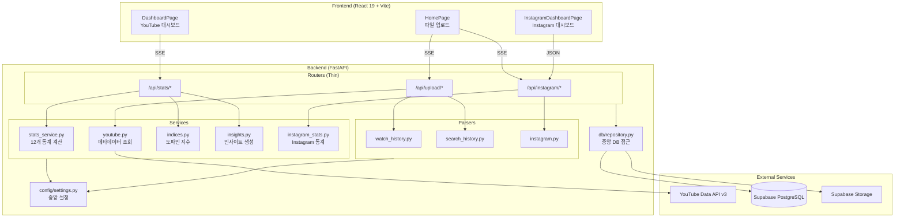
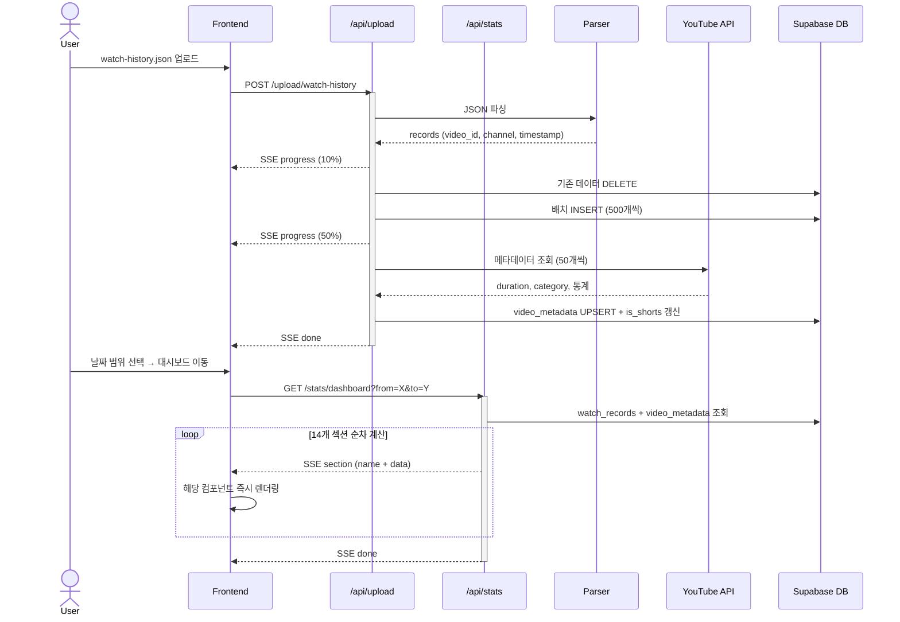
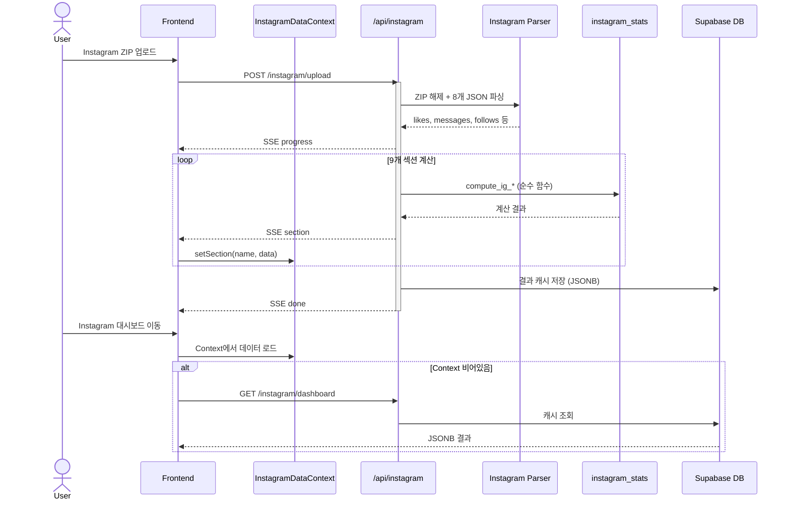

# WatchLens - Software Architecture

## Overview

WatchLens는 YouTube 시청 기록과 Instagram 데이터를 분석하여 사용자의 미디어 소비 패턴을 시각화하는 풀스택 웹 애플리케이션이다.

**핵심 기술 스택**: FastAPI + Supabase (Backend) / React 19 + TypeScript + Vite (Frontend)

---

## 시스템 구성도



---

## Backend 구조

### 디렉토리 레이아웃

```
backend/
├── app/
│   ├── main.py              # FastAPI 앱 초기화, CORS, 라우터 등록
│   ├── db/
│   │   ├── supabase.py      # Supabase 클라이언트 (싱글턴)
│   │   └── repository.py    # 중앙 DB 접근 함수 (모든 테이블)
│   ├── models/
│   │   └── schemas.py       # Pydantic 모델 (UploadResponse, ParseResult 등)
│   ├── parsers/
│   │   ├── watch_history.py # YouTube 시청 기록 JSON 파싱
│   │   ├── search_history.py# YouTube 검색 기록 JSON 파싱
│   │   └── instagram.py     # Instagram ZIP 압축 해제 + 8개 JSON 파싱
│   ├── routers/
│   │   ├── upload.py        # POST /api/upload/* (Thin Router)
│   │   ├── stats.py         # GET /api/stats/*  (Thin Router)
│   │   └── instagram.py     # POST/GET /api/instagram/* (Thin Router)
│   ├── services/
│   │   ├── stats_service.py # YouTube 대시보드 12개 통계 계산 (순수 함수)
│   │   ├── youtube.py       # YouTube Data API v3 메타데이터 조회
│   │   ├── indices.py       # 도파민 지수 산출
│   │   ├── insights.py      # 규칙 기반 인사이트 생성
│   │   └── instagram_stats.py # Instagram 통계 계산 (순수 함수)
│   └── utils.py             # SSE 포맷터, 시간대 변환, 배치 처리 유틸
├── config/
│   └── settings.py          # 모든 설정값 중앙 관리
├── tests/                   # pytest 69개 테스트
└── requirements.txt
```

### 레이어 구분

| 레이어 | 역할 | 원칙 |
|--------|------|------|
| **Routers** | HTTP 엔드포인트, SSE 스트리밍 오케스트레이션 | I/O 담당, 비즈니스 로직 없음 (Thin Router) |
| **Parsers** | 외부 데이터 포맷 → 내부 레코드 변환 | 순수 변환 함수, 부수효과 없음 |
| **Services** | 비즈니스 로직 (통계, 지수, 인사이트) | 순수 함수, DB 호출 없음 |
| **Repository** | 모든 DB 접근 (CRUD, 페이지네이션, 스토리지) | 단일 진입점, 테이블 스키마 캡슐화 |
| **DB** | Supabase 클라이언트 | 싱글턴 패턴 |
| **Config** | 임계값, 매핑, 가중치 등 설정 | 단일 파일 중앙 관리 |

### 주요 API 엔드포인트

| Method | Path | 설명 | 응답 방식 |
|--------|------|------|-----------|
| POST | `/api/upload/watch-history` | 시청 기록 JSON 업로드 | SSE |
| POST | `/api/upload/search-history` | 검색 기록 JSON 업로드 | SSE |
| GET | `/api/stats/period` | 데이터 기간 조회 | JSON |
| GET | `/api/stats/dashboard` | YouTube 대시보드 (14개 섹션) | SSE |
| POST | `/api/instagram/upload` | Instagram ZIP 업로드 | SSE |
| GET | `/api/instagram/dashboard` | Instagram 대시보드 (캐시) | JSON |

---

## Frontend 구조

### 디렉토리 레이아웃

```
frontend/src/
├── App.tsx                    # 라우팅 정의 + Provider 구성
├── main.tsx                   # 엔트리포인트
├── hooks/
│   └── useSseStream.ts        # SSE 파싱 커스텀 훅 (GET/POST 공용)
├── contexts/
│   ├── YouTubeDataContext.tsx  # YouTube 대시보드 전역 상태 + 기간 관리
│   └── InstagramDataContext.tsx # Instagram 대시보드 전역 상태
├── pages/
│   ├── HomePage.tsx           # 파일 업로드 + 기간 선택
│   ├── DashboardPage.tsx      # YouTube 대시보드
│   └── InstagramDashboardPage.tsx
├── components/
│   ├── layout/
│   │   ├── Layout.tsx         # 사이드바 + Outlet 래퍼
│   │   └── Sidebar.tsx        # 좌측 네비게이션
│   ├── FileUploader.tsx       # 드래그앤드롭 업로드 + SSE 진행률
│   ├── UploadResultCard.tsx   # 업로드 결과 카드
│   ├── PeriodSelector.tsx     # 날짜 범위 선택기
│   ├── SummaryCards.tsx       # KPI 카드 (총 시청, 채널 수 등)
│   ├── HourlyChart.tsx        # 시간대별 분포 (Bar)
│   ├── DailyChart.tsx         # 일별 추이 (Area)
│   ├── DayOfWeekChart.tsx     # 요일별 분포
│   ├── TopChannels.tsx        # 상위 채널 (일반/Shorts 분리)
│   ├── Categories.tsx         # 카테고리 비율 (Pie)
│   ├── WatchTime.tsx          # 시청시간 추정
│   ├── ShortsStats.tsx        # Shorts 통계
│   ├── DopamineIndex.tsx      # 도파민 지수
│   ├── ViewerType.tsx         # 시청자 유형 (16유형)
│   ├── SearchKeywords.tsx     # 검색 키워드 Top 30
│   ├── InsightSummary.tsx     # 자연어 인사이트
│   └── instagram/             # Instagram 전용 컴포넌트 7개
├── contexts/
│   └── InstagramDataContext.tsx # Instagram 데이터 전역 상태
└── utils/
    ├── chartConfig.ts         # 차트 공통 스타일
    └── iconMap.tsx            # 이모지 → Lucide 아이콘 매핑
```

### 라우팅

| 경로 | 페이지 | 설명 |
|------|--------|------|
| `/` | HomePage | 파일 업로드 + 기간 선택 |
| `/youtube/dashboard` | DashboardPage | YouTube 분석 대시보드 |
| `/instagram/dashboard` | InstagramDashboardPage | Instagram 분석 대시보드 |

### 차트 라이브러리

**Recharts v3** 사용. Bar, Area, Pie 등 다양한 차트 타입으로 데이터 시각화. 공통 스타일은 `chartConfig.ts`에서 관리.

---

## 데이터베이스 스키마

### watch_records
시청 기록 원본 데이터. user_id + watched_at 기반으로 조회.

| 컬럼 | 타입 | 설명 |
|------|------|------|
| id | BIGSERIAL PK | |
| user_id | TEXT | 기본값: 고정 UUID |
| video_id | TEXT | YouTube 영상 ID |
| video_title | TEXT | 영상 제목 |
| channel_name | TEXT | 채널명 |
| watched_at | TIMESTAMPTZ | 시청 시각 (UTC) |
| is_shorts | BOOLEAN | Shorts 여부 |

### video_metadata
YouTube Data API에서 가져온 영상 메타데이터.

| 컬럼 | 타입 | 설명 |
|------|------|------|
| video_id | TEXT PK | |
| category_id / category_name | INT / TEXT | YouTube 카테고리 |
| duration_seconds | INT | 영상 길이 (초) |
| view_count, like_count | BIGINT | 조회수, 좋아요 |

### search_records
검색 기록. query + searched_at 저장.

### instagram_dashboard_results
Instagram 분석 결과 캐시. 9개 섹션을 JSONB로 저장.

---

## 핵심 데이터 플로우

### YouTube 시청 기록: 업로드 → 대시보드



### Instagram: 업로드 → 대시보드



---

## 주요 아키텍처 패턴

### 1. SSE 기반 스트리밍
업로드와 대시보드 모두 **Server-Sent Events**를 사용하여 실시간 진행률과 데이터를 점진적으로 전달한다. 사용자는 전체 계산이 끝나기 전에 먼저 도착한 섹션을 볼 수 있다.

### 2. 순수 함수 기반 계산
`services/` 내의 `compute_*` 함수들은 순수 함수로, DB 호출 없이 입력 데이터만으로 결과를 산출한다. 라우터가 DB 조회와 계산을 조율하는 역할을 한다.

### 3. 중앙 집중 설정
모든 임계값, 가중치, 매핑 테이블은 `config/settings.py`에 선언되어 있다. 핵심 로직 수정 없이 설정만 변경하여 동작을 조정할 수 있다.

### 4. 배치 처리
- DB 삽입: 500개 단위 (`DB_CHUNK_SIZE`)
- DB 조회: 1000개 단위 페이지네이션 (`PAGE_SIZE`)
- YouTube API: 50개 단위 (`YOUTUBE_BATCH_SIZE`)

### 5. 시간대 처리
- DB 저장: UTC
- 사용자 표시: KST (UTC+9)
- 날짜 범위 쿼리 시 KST → UTC 변환 후 조회

---

## 환경 변수

| 변수 | 용도 |
|------|------|
| `SUPABASE_URL` | Supabase 프로젝트 URL |
| `SUPABASE_KEY` | Supabase anon key |
| `YOUTUBE_API_KEY` | YouTube Data API v3 키 |

---

## 개발 환경

```bash
# 백엔드 + 프론트엔드 동시 실행
./dev.sh

# 개별 실행
cd backend && uvicorn app.main:app --reload --port 8000
cd frontend && npm run dev  # localhost:5173
```

---

## 아키텍처 평가

### 강점

| 항목 | 설명 |
|------|------|
| **SSE 기반 점진적 로딩** | 대시보드 14개 섹션을 순차 스트리밍하여 사용자가 기다리지 않고 먼저 도착한 데이터를 바로 볼 수 있다. |
| **중앙 설정 관리** | `config/settings.py` 단일 파일에 임계값·가중치·매핑을 모아 관리. 조정이 쉽다. |
| **순수 함수 서비스 레이어** | `stats_service.py`, `instagram_stats.py` 모두 DB 호출 없는 순수 함수로 구성. 테스트 용이. |
| **Repository 패턴** | `db/repository.py`에 모든 DB 접근이 집중. 스키마 변경 시 단일 파일만 수정하면 된다. |
| **Thin Router** | 라우터는 SSE 오케스트레이션만 담당. 비즈니스 로직 없음. |
| **YouTube/Instagram 대칭** | 두 도메인이 동일한 패턴 (Context + Service + Repository) 사용. |
| **SSE 훅 통합** | `useSseStream` 커스텀 훅으로 SSE 파싱 로직 일원화. |
| **일관된 에러 처리** | 모든 SSE 스트림에 try-catch 적용. 실패 시 error 이벤트 전송. |

### 리팩토링 이력 (2026-03-30)

| 이전 문제 | 해결 방법 | 상태 |
|-----------|-----------|------|
| stats.py 560줄 God Router | → 168줄 Thin Router + stats_service.py (순수 함수) | 해결됨 |
| DB 접근 산재 (라우터 직접 호출) | → db/repository.py 단일 진입점 | 해결됨 |
| SSE 파싱 로직 중복 | → hooks/useSseStream.ts 커스텀 훅 | 해결됨 |
| YouTube Context 없음 (비대칭) | → YouTubeDataContext 추가 | 해결됨 |
| 에러 처리 불일치 | → 모든 스트림 try-catch + error 이벤트 | 해결됨 |
